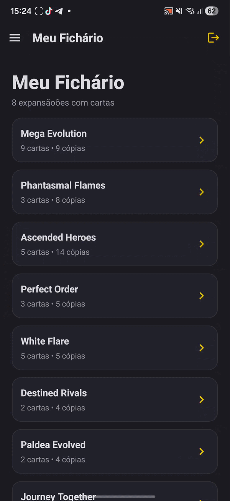

# PokéCollector — Gerenciador Pessoal de Coleção Pokémon TCG

## Visão Geral e Requisitos

**Tema:** Aplicação mobile para colecionadores de Pokémon TCG (Trading Card Game).

**Motivação:** Como colecionador, identifiquei a necessidade de uma ferramenta centralizada para controlar o inventário de cartas (fichário), acompanhar o progresso de completude de cada expansão lançada e auxiliar durante partidas reais com ferramentas utilitárias.

**Objetivo:** Oferecer uma experiência fluida para registrar cartas possuídas, validar a legalidade de decks criados e fornecer suporte técnico (sorteios e timers) durante o jogo físico.

**Requisitos do Projeto Atendidos:**
- **Mínimo de 6 telas:** O projeto conta com 8 telas principais (Dashboard, Fichário, Explorar, Detalhes da Expansão, Lista de Decks, Criador de Deck, Editor de Deck e Ferramentas).
- **Navegação:** Implementada via `Expo Router` utilizando uma combinação de **Drawer Navigation** (menu lateral) e **Stack Navigation** (fluxos internos).
- **Banco de Dados (CRUD):** Integração total com **Firebase Firestore** para persistência de dados em nuvem por usuário.
- **Sensores e Atuadores:** Uso de **Acelerômetro** (sensor) para detecção de movimento e **Vibração/Áudio** (atuadores) para feedback ao usuário.
- **Interface e UX:** Design moderno em Dark Mode, com alinhamento consistente, espaçamento adequado e feedbacks visuais de carregamento e erro.

---

## Tecnologias Utilizadas

- **Linguagem:** TypeScript.
- **Framework:** React Native com Expo (SDK 54).
- **Navegação:** Expo Router (Roteamento baseado em arquivos).
- **Backend (Nuvem):** 
  - Firebase Authentication (Gestão de usuários).
  - Firestore (Banco de dados NoSQL em tempo real).
- **API de Dados:** Pokémon TCG API v2 (via Axios).
- **Bibliotecas de Hardware/Nativa:**
  - `expo-sensors`: Captura de dados do acelerômetro.
  - `expo-haptics`: Controle de atuador de vibração.
  - `expo-av`: Sistema de áudio para efeitos sonoros.
- **Estilização e UX:** 
  - Vanilla StyleSheet (CSS-in-JS) para controle total de layout.
  - `react-native-reanimated` e `react-native-gesture-handler` para interações suaves.

---

## Funcionalidades

### 1. Autenticação e Perfil
Sistema de login e cadastro integrado ao Firebase. Cada usuário possui seu próprio documento no banco de dados, garantindo que sua coleção seja privada e sincronizada entre dispositivos.

### 2. Gestão de Fichário (CRUD Completo)
O coração do app permite o controle total das cartas que o usuário possui:
- **Create:** Adicionar cartas ao clicar em "Eu tenho".
- **Read:** Visualizar progresso de expansões no Dashboard e listar cartas possuídas filtradas por set.
- **Update:** Incrementar ou decrementar a quantidade de cópias de cada carta.
- **Delete:** Remover cartas do inventário.

### 3. Construtor e Validador de Decks
Uma funcionalidade complexa que permite criar decks respeitando as regras oficiais:
- Validação de limite de 60 cartas.
- Verificação de limite de 4 cópias por carta (exceto energias básicas).
- Classificação por tipo de deck (Simulado vs Real).

### 4. Ferramentas de Partida (Sensores e Atuadores)
Melhoria da interação do usuário com o hardware do celular:
- **Giro de Moeda e Dados:** Sorteios aleatórios com feedback de **vibração (Haptic)** e **som**.
- **Acelerômetro:** O dado pode ser rolado fisicamente ao "chacoalhar" o aparelho (detectado via sensor de movimento).
- **Timer de Turno:** Cronômetro com alertas sonoros ao finalizar o tempo.

### 5. Exploração de Catálogo
Acesso a milhares de cartas de todas as gerações através da integração com a Pokémon TCG API, com suporte a paginação (Infinite Scroll) e busca por nome ou número.

---

## Demonstração
</img>

Demonstração completa do app disponível no <a href="https://youtube.com/shorts/I3xsHive_4k">Link.</a>
---

## Instalação e Execução

Para rodar este projeto localmente, siga os passos abaixo:

1. **Clonar o repositório:**
   ```bash
   git clone https://github.com/EnricoNSilva/Pokecolletor.git
   cd Pokecolletor
   ```

2. **Instalar dependências:**
   ```bash
   npm install
   ```

3. **Configurar Variáveis de Ambiente:**
   Crie um arquivo `.env` na raiz do projeto seguindo o modelo do `.env.example` e insira suas credenciais do Firebase.

4. **Iniciar o servidor Expo:**
   ```bash
   npx expo start
   ```
   *Utilize o aplicativo **Expo Go** no Android para escanear o QR Code ou pressione `w` para abrir a versão Web.*

---

## Aprendizados e Próximos Passos

### Aprendizados Principais
Desenvolver este projeto trouxe desafios técnicos significativos, especialmente na **lógica de ordenação de dados**. As cartas Pokémon possuem numerações alfanuméricas complexas (ex: 101/100, TG23, SV01), o que exigiu a criação de um algoritmo de ordenação customizado no front-end para garantir uma experiência de visualização correta. Além disso, a implementação de **sensores** exigiu um tratamento cuidadoso de permissões e disponibilidade de hardware entre diferentes plataformas (Android vs Web).

### Próximos Passos
- Implementar cache local persistente para reduzir o consumo da API.
- Adicionar suporte a leitura de QR Code para importar listas de decks.
- Criar um sistema de "Lista de Desejos" (Wishlist) para cartas que o usuário ainda não possui.
